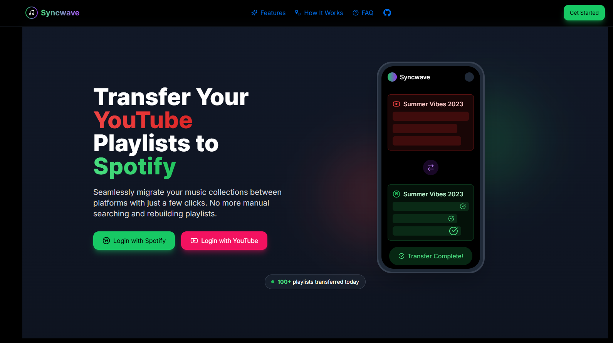

# 🚧 Project Under Construction 🚧

This repository is currently a work in progress. 




# 🎵 Syncwave – Seamless Playlist Transfer Between YouTube & Spotify

**Synwave** is a full-stack web app that lets users securely transfer their YouTube playlists to Spotify with just a few clicks. Built with a beautiful modern UI and a Python backend, this app handles authentication, track matching, and playlist creation; all while offering progress feedback and unmatched track logs.

---

## Features

- 🔐 OAuth2 login with Google (YouTube) and Spotify
- 🔁 Automatically matches and transfers songs from YouTube to Spotify
- 📁 Saves unmatched songs for manual review
- 📊 Rich CLI + UI progress indicators and summary stats
- 🧠 Designed to support Spotify → YouTube in future

---

## Tech Stack

### Frontend
- [Next.js](https://nextjs.org/)
- [React](https://react.dev/)
- [TypeScript](https://www.typescriptlang.org/)
- [Tailwind CSS](https://tailwindcss.com/)
- [Hero UI](https://www.heroui.com/)

### Backend
- [Python](https://www.python.org/)
- [Spotipy](https://spotipy.readthedocs.io/)
- [Google API Client](https://github.com/googleapis/google-api-python-client)
- [Rich](https://rich.readthedocs.io/)

---

## Project Structure
```bash
youtube-to-spotify/
├── backend/
│   ├── youtube_api.py
│   ├── spotify_api.py
│   └── main.py
├── frontend/
│   ├── app
│   ├── page.tsx
    ├── layout.tsx
│   └── sections
│       ├── Header.tsx
│       ├── Hero.tsx
│       ├── Features.tsx
│       ├── HowItWorks.tsx
│       ├── Testimonial.tsx
│       └── Footer.tsx
│   └── components/
├── public/
├── output/ (generated logs)
└── README.md

```

## How to Run

### 1. Clone the repo
```bash
git clone https://github.com/your-username/youtube-to-spotify.git
cd youtube-to-spotify
```


### 2. Set up the backend (Python)
```
cd backend
python3 -m venv venv
source venv/bin/activate  # Use venv\Scripts\activate on Windows
pip install -r requirements.txt
```

### 2.1: Create a `.env` file in `backend/`
#### YouTube API
```bash
YOUTUBE_CLIENT_SECRET_FILE=googleCloud_client_secret.json
YOUTUBE_SCOPES=https://www.googleapis.com/auth/youtube.readonly
```

#### Spotify API
```bash
SPOTIPY_CLIENT_ID=your_spotify_client_id
SPOTIPY_CLIENT_SECRET=your_spotify_client_secret
SPOTIFY_SCOPE=playlist-modify-private playlist-modify-public
SPOTIPY_REDIRECT_URI=http://127.0.0.1:8080/callback
```


### 3.  Set up the frontend (Next.js + Tailwind + Hero UI)
```bash
cd ../frontend
pnpm install
pnpm dev
```


The frontend will run on `http://localhost:3000`


#### Run the backend script (optional CLI tool)
```bash
cd backend
source venv/bin/activate
python main.py --playlist <playlist_name> --public
```


### 4. Output files
 - 📝 Logs for unmatched songs are saved to logs/
 - 📊 Match statistics printed to console and saved in output/
