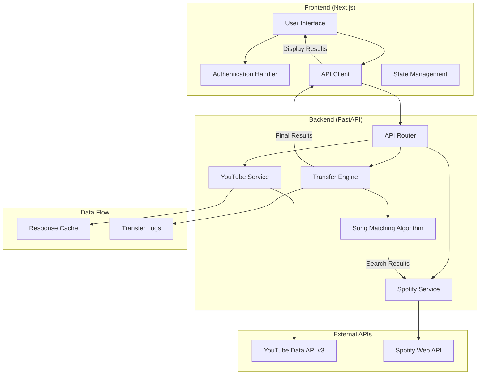
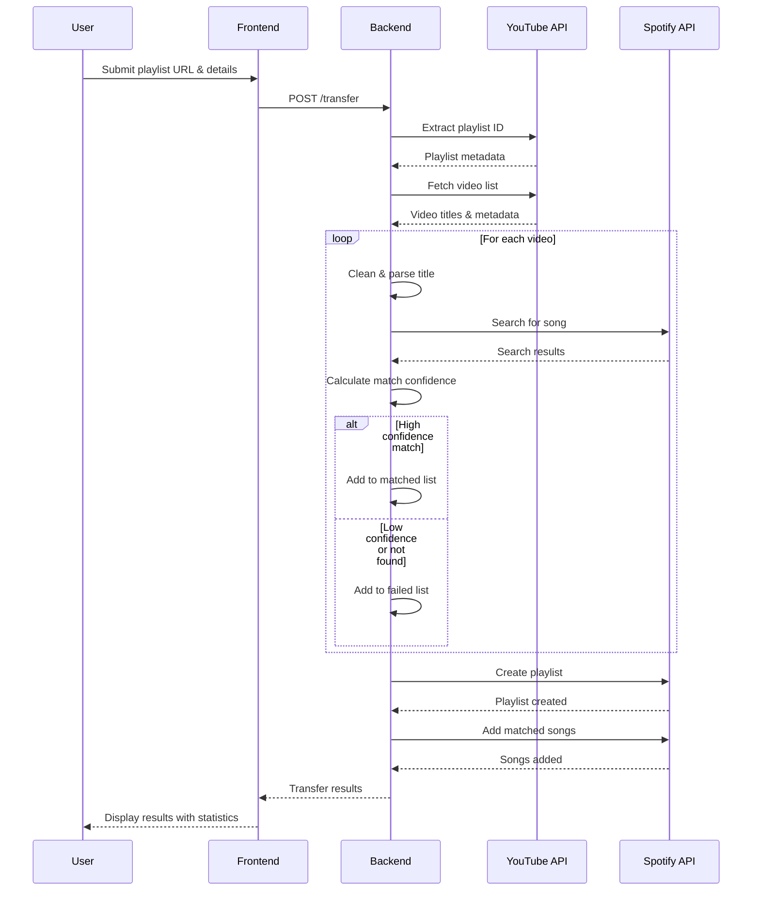

# Syncwave

A production-ready full-stack application for seamlessly transferring YouTube playlists to Spotify with intelligent song matching and comprehensive transfer analytics.


## System Architecture



**Flow Process:**
+ **User interaction** starts at the frontend UI, which handles authentication and communicates with the backend
+ **Backend API Router** receives requests and coordinates between YouTube, Spotify, and Transfer services
+ **External APIs** (YouTube Data API v3 and Spotify Web API) provide the core data and functionality
+ **Transfer Engine** orchestrates the entire process, using the Song Matching Algorithm for intelligent pairing
+ **Data persistence** happens through response caching and comprehensive transfer logging
+ **Results flow back** through the API client to display rich analytics and transfer status to users

## Transfer Flow



**Flow:**
+ **User initiates transfer** by submitting YouTube playlist URL and desired Spotify playlist settings
+ **Backend extracts playlist data** from YouTube API, including video metadata, titles, and thumbnails
+ **Intelligent song matching** processes each video through multiple search strategies and confidence scoring
+ **Dual-path processing** separates successfully matched songs from failed matches with detailed error tracking
+ **Spotify playlist creation** and bulk song addition happens efficiently using batch operations
+ **Comprehensive results delivery** includes transfer statistics, individual song status, and performance metrics

## Technology Stack

### Frontend
- **Framework**: Next.js
- **Language**: TypeScript
- **Styling**: Tailwind CSS with HeroUI components
- **Animations**: GSAP
- **HTTP Client**: Axios

### Backend
- **Framework**: FastAPI
- **Language**: Python 3.11+
- **YouTube Integration**: Google API Client
- **Spotify Integration**: Spotipy
- **Environment**: Python-dotenv
- **Logging**: Rich (Console) + Python logging

### APIs
- **YouTube Data API v3**: Playlist and video metadata extraction
- **Spotify Web API**: Playlist creation and song search

## Prerequisites

- Node.js 18+ and npm/pnpm (preferred)
- Python 3.11+
- Google Cloud Project with YouTube Data API enabled
- Spotify Developer Account

## Installation

### 1. Clone Repository
```bash
git clone https://github.com/your-username/syncwave.git
cd syncwave
```

### 2. Backend Setup

#### Install Dependencies
```bash
cd backend
python -m venv venv
source venv/bin/activate  # Windows: venv\Scripts\activate
pip install -r requirements.txt
```

#### Environment Configuration
Create `backend/.env`:
```env
# YouTube API Configuration
YOUTUBE_CLIENT_JSON=path/to/client_secret.json
YOUTUBE_SCOPE=https://www.googleapis.com/auth/youtube.readonly

# Spotify API Configuration
SPOTIFY_CLIENT_ID=your_spotify_client_id
SPOTIFY_CLIENT_SECRET=your_spotify_client_secret
SPOTIFY_REDIRECT_URI=http://localhost:8080/callback
SPOTIFY_SCOPE=playlist-modify-public playlist-modify-private

# Application Configuration
API_BASE_URL=http://localhost:8000
```

#### API Credentials Setup

**Google Cloud (YouTube)**:
1. Create project at [Google Cloud Console](https://console.cloud.google.com)
2. Enable YouTube Data API v3
3. Create OAuth credentials
4. Download client secret JSON file

**Spotify**:
1. Create app at [Spotify Developer Dashboard](https://developer.spotify.com/dashboard)
2. Add redirect URI: `http://localhost:8080/callback`
3. Copy Client ID and Client Secret

### 3. Frontend Setup

#### Install Dependencies
```bash
cd frontend
npm install
# or
pnpm install
```

#### Environment Configuration
Create `frontend/.env.local`:
```env
NEXT_PUBLIC_API_BASE_URL=http://localhost:8000
```

## Development

### Start Backend Server
```bash
cd backend
source venv/bin/activate
uvicorn main:app --reload --port 8000
```

### Start Frontend Development Server
```bash
cd frontend
npm run dev
# or
pnpm dev
```

Access the application at `http://localhost:3000`

## API Documentation

### Transfer Endpoint
```http
POST /transfer
Content-Type: application/json

{
  "playlist_url": "https://www.youtube.com/playlist?list=...",
  "playlist_name": "My Transferred Playlist",
  "is_public": true,
  "description": "Transferred from YouTube"
}
```

### Response Format
```json
{
  "success": true,
  "playlist_id": "spotify_playlist_id",
  "playlist_url": "https://open.spotify.com/playlist/...",
  "total_songs": 25,
  "transferred_songs": 22,
  "failed_songs": 3,
  "songs": [
    {
      "id": "song_1",
      "title": "Song Title",
      "artist": "Artist Name",
      "album": "Album Name",
      "status": "success",
      "spotify_url": "https://open.spotify.com/track/...",
      "youtube_url": "https://www.youtube.com/watch?v=...",
      "thumbnail": "https://i.scdn.co/image/..."
    }
  ],
  "transfer_duration": 45.7,
  "created_at": "2024-01-15T10:30:00Z"
}
```

## Project Structure

```
syncwave/
├── backend/
│   ├── api/
│   │   └── transfer.py              # API route handlers
│   ├── services/
│   │   ├── youtube_api.py           # YouTube API integration
│   │   ├── spotify_api.py           # Spotify API integration
│   │   └── transfer_api.py          # Transfer orchestration
│   ├── models/
│   │   └── transfer.py              # Pydantic models
│   ├── credentials/                 # API credentials (gitignored)
│   ├── cache/                       # API response cache
│   └── main.py                      # FastAPI application
├── frontend/
│   ├── app/
│   │   ├── page.tsx                 # Home page
│   │   ├── layout.tsx               # Root layout
│   │   └── get-started/
│   │       └── page.tsx             # Transfer flow page
│   ├── components/
│   │   ├── get-started/             # Transfer flow components
│   │   └── ui/                      # Reusable UI components
│   ├── utils/
│   │   └── api_routes/
│   │       └── api.ts               # API client configuration
│   └── types/
│       └── index.ts                 # TypeScript type definitions
├── .gitignore
├── README.md
└── requirements.txt
```

## Core Features

### Intelligent Song Matching
- Multiple search strategies for improved accuracy
- Confidence scoring algorithm
- Support for multi-artist tracks
- Handling of remixes, covers, and alternate versions

### Transfer Analytics
- Real-time progress tracking
- Detailed success/failure reporting
- Performance metrics and timing
- Comprehensive error logging

### User Experience
- Responsive design with dark theme
- GSAP-powered animations
- Form validation and error handling
- Progress visualization

## Configuration

### Timeout Settings
Default API timeout is 120 seconds for transfer operations. Adjust in `frontend/utils/api_routes/api.ts`:

```typescript
const api = axios.create({
  timeout: 120000, // 2 minutes
});
```

### Matching Algorithm
Confidence threshold for song matching is 60%. Modify in `backend/services/spotify_api.py`:

```python
minimum_confidence = 0.6  # Adjust as needed
```

## Troubleshooting

### Common Issues

**Transfer Timeout**
- Increase timeout in API configuration
- Check network connectivity
- Verify API rate limits

**Authentication Errors**
- Verify API credentials in `.env` files
- Check redirect URI configuration
- Ensure required OAuth scopes are granted

**Song Matching Issues**
- Review confidence threshold settings
- Check YouTube title parsing logic
- Verify Spotify search query generation

## Contributing

1. Fork the repository
2. Create a feature branch (`git checkout -b feature/amazing-feature`)
3. Commit changes (`git commit -m 'Add amazing feature'`)
4. Push to branch (`git push origin feature/amazing-feature`)
5. Open a Pull Request

## License

This project is licensed under the MIT License - see the [LICENSE](LICENSE) file for details.

## Acknowledgments

- YouTube Data API v3 for playlist data access
- Spotify Web API for playlist creation and management
- Next.js and FastAPI communities for excellent documentation
